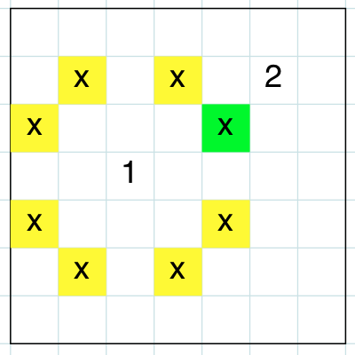
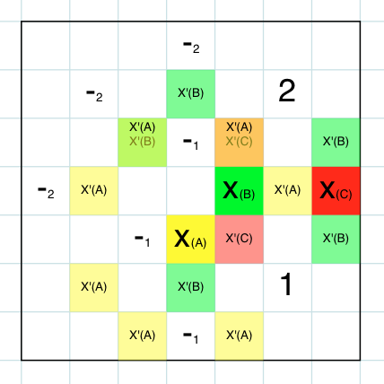

# Heuristics Analysis

## Strategies

### Following

The player follows it's opponent, as shown in figure 1.



### Tread on opponent's toe
If the active player is just one move away from the opponent, it's "toe" is hit.
This special move, "tread on the opponent's toe" removes one of the legal moves of the opponent, which i think can be of an advantage (of course there are special cases when it's not, which are hard to find because of the horizon effect).
If this happens the improved score is duplicated, see figure 2 for an example.



### Stalking
Mixed strategy where the player tries to close in on the opponent, always trying to tread on it's toes.

## The scorers

1. "Improved Stalker"
    - start & middle: Stalker
    - end: uses improved score which is duplicated if opponent's toe is hit
2. "The Stalker"
    - always tries to tread on the toe of the opponent or else close in on the opponent
3. "The Wanderer"
    - start: tries to stay at the center of the board
    - middle: tries to close in on the opponent
    - end: uses improved score which is duplicated if opponent's toe is hit

## Results:
```
Match #   Opponent    AB_Improved   AB_Custom   AB_Custom_2  AB_Custom_3
                       Won | Lost   Won | Lost   Won | Lost   Won | Lost
   1       Random      452 |  48    469 |  31    450 |  50    452 |  48  
   2       MM_Open     383 |  117   379 |  121   361 |  139   377 |  123
   3      MM_Center    432 |  68    434 |  66    437 |  63    441 |  59  
   4     MM_Improved   345 |  155   361 |  139   348 |  152   340 |  160
   5       AB_Open     258 |  242   266 |  234   253 |  247   237 |  263
   6      AB_Center    281 |  219   272 |  228   270 |  230   269 |  231
   7     AB_Improved   236 |  264   229 |  271   238 |  262   242 |  258
--------------------------------------------------------------------------
          Win Rate:      68.2%        68.9%        67.3%        67.4%    
```

## Analysis of Performance of Best Scorer

The average win rate of the "Improved Stalker" against the opponents is 68.9%, which is slightly better then the plain Alpha Beta Improved.

### Random(93.8% win rate)
The random scorer produces a constant score, so the opponent's next move will always be a legal but random move.
The custom scorer makes forecasts and predictions over the next steps, so it is superior.

### MM_Open(75.8% win rate)
All Minimax variants need to evaluate all subtrees for their forecasts, so Alpha Beta wins because it can prune subtrees whenever siblings can't improve on the prediction anymore.
The aggressive improved score in the end phase helps against the open scorer.

### MM_Center(86.8% win rate)
Minimax vs Alpha Beta applies here too.
The MM_Center scorer tries to stay away from the center whereas the custom scorer tries to follow the opponent. Maybe the opponent gets trapped in one of corners more easily.

### MM_Improved(72.2% win rate)
Minimax vs Alpha Beta applies here too.
The performance is worse than against MM_Open, because the Improved Scorer also counts the opponent's moves. But still "Improved Stalker" slightly outperforms it's rivals.

### AB_Open(53.2% win rate)
Now that Alpha Beta competes against Alpha Beta, which means that for the following matches the scorer is much more important.
It is interesting to see that AB_Open almost en pair. Maybe it's because of it's cheap scorer function which only evaluates the number of it's own legal moves.

### AB_Center(54.4% win rate)
AB_Center scorer only looks at it's own position. The custom scorer takes the opponent's position into account, so together with the aggressive improved score in the end phase the custom scorer has a slight advantage.

### AB_Improved(45.8% win rate)
It's hard to win against improved score, because it is an efficient and high quality prediction heuristic. Rewarding of hitting the toes in the end phase does probably not generate better predictions.

## Improvements, ideas
Some thoughts on improvements, thinking outside of the scorer.

- More Variations and combinations of improved score, moving around (staying in the center or moving in circles?), stepping on toes, visit quadrants with potentially more blank spaces, mirror opponents moves,...
- Partitioning:
    - for all free spaces check how many the spaces are unreachable (i.e. no legal move to that space exists), this number could also be an indicator for when the ending phase begins
- Analyse opponent heuristic
- caching of progress of current pry
- keeping history of the game and opponent moves
- since the stalker scorer maximises on getting near the opponent, the implementation assumes the opponent's scorer to flee from the player. so it would be interesting to choose an opponent scorer in the min-value function depending on the opponent's play style
